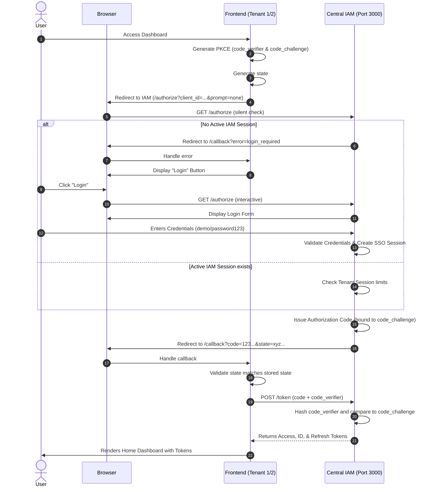

# System Architecture & Security Documentation

This document explains the architectural flow of the OAuth 2.0 and OpenID Connect (OIDC) implementation, detailing how the system operates, the security mechanisms implemented, and how they prevent common security breaches.

## 1. Architectural Overview

The system is designed as a **Microservices Monorepo** simulating a typical Enterprise Single Sign-On (SSO) environment. It consists of three independent components:

1. **Central IAM (Identity and Access Management) Server (Port 3000)**
   - Acts as the Authorization Server (OAuth 2.0) and Identity Provider (OIDC).
   - Manages global user sessions (SSO).
   - Generates and signs JSON Web Tokens (JWTs) using asymmetric RS256 cryptography.
   - Enforces Tenant-level Session Limits.

2. **Frontend 1 (Port 3001) / Tenant 1**
   - A single-page application (SPA) acting as a relying party (OAuth Client).
   - Implements the Authorization Code Flow with PKCE.

3. **Frontend 2 (Port 3002) / Tenant 2**
   - A distinct SPA with identical OAuth capabilities but its own independent tenant configuration and session limit rules.

## 2. The Authentication Flow (Authorization Code + PKCE)

The lab strictly implements the **Authorization Code Flow with Proof Key for Code Exchange (PKCE)**, which is the modern standard for SPAs.

### Step-by-Step Flow:

1. **Initiation**: The user attempts to access a protected resource on a Frontend (e.g., Tenant 1) without a valid access token.
2. **PKCE Generation**: The frontend locally generates a `code_verifier` (a random string) and hashes it with SHA-256 to create a `code_challenge`.
3. **Authorization Request**: The frontend redirects the user's browser to the Central IAM's `/authorize` endpoint, passing `client_id`, `state`, `code_challenge`, and `code_challenge_method=S256`.
4. **User Authentication**: The IAM server prompts the user for credentials. (If a valid `iam_session` cookie exists, this step is skipped).
5. **Code Issuance**: The IAM server verifies credentials, creates an Authorization Code bound specifically to the provided `code_challenge`, and redirects back to the frontend with the `code` and the original `state`.
6. **Token Exchange**: The frontend verifies the `state` matches what it originally generated, then calls the IAM's `/token` endpoint via a direct POST request, sending the `code` and the original plain-text `code_verifier`.
7. **PKCE Validation**: The IAM server takes the `code_verifier`, hashes it using SHA-256, and compares it to the original `code_challenge` provided in step 3. 
8. **Token Issuance**: If the hash matches, the IAM server issues an `access_token`, `id_token`, and `refresh_token`.

## 3. Security Advantages & Breach Prevention

This architecture specifically mitigates multiple categories of cyber threats by utilizing modern security patterns.

### A. Proof Key for Code Exchange (PKCE)
**Threat Prevented:** Authorization Code Interception Attack.
- **How it happens without PKCE:** If a malicious app manages to register the same custom URI scheme or intercept the browser's callback URL, it can steal the Authorization Code. In a standard flow, the malicious app could then exchange that code for an Access Token.
- **How PKCE prevents it:** The IAM server will only exchange the code for a token if the request contains the original `code_verifier`. Since the `code_verifier` is stored securely in the legitimate frontend's `sessionStorage` and was never sent over the network during the initial authorization request (only the hashed `code_challenge` was sent), the attacker cannot complete the exchange.

### B. The `state` Parameter
**Threat Prevented:** Cross-Site Request Forgery (CSRF) & Login CSRF.
- **How it happens without state:** An attacker could initiate a login flow on their own machine, get an authorization code, and then trick a victim into clicking a link containing that code. The victim's browser would exchange the code and log the victim into the *attacker's* account, allowing the attacker to monitor the victim's activity.
- **How state prevents it:** The frontend generates a random `state` string and stores it in `sessionStorage` before redirecting. When the IAM redirects back, the frontend checks if the returned `state` matches the stored one. Because the attacker's generated state won't exist in the victim's local browser storage, the frontend will reject the malicious callback payload.

### C. Single-Use Authorization Codes
**Threat Prevented:** Replay Attacks.
- **How it works:** The Authorization Code has a very short lifespan (e.g., 60 seconds) and a strict boolean `used` flag. If an attacker somehow obtains a used authorization code and attempts to exchange it, the IAM server will reject it with an `invalid_grant` error.

### D. Asymmetric JWT Signatures (RS256)
**Threat Prevented:** Token Forgery and Key Compromise.
- **How it works:** The IAM server generates tokens signed with an RSA Private Key. The Frontends (and any resource servers) use the IAM's publicly exposed JSON Web Key Set (`/jwks.json`) to verify the signature. 
- **Advantage:** Unlike symmetric algorithms (HS256) where both the IAM and the Frontend need the same secret password, RS256 means the Frontends only need the public key. An attacker compromising a frontend server cannot forge new tokens.

### E. Silent SSO Validation (`prompt=none`)
**Threat Prevented:** Phishing / Unnecessary Credential Exposure.
- **How it works:** When a user navigates to a Frontend, the app checks if an SSO session already exists on the IAM server via a silent redirect (`prompt=none`). If a session exists, the IAM seamlessly provisions a new token without showing a login screen. 
- **Advantage:** Users do not suffer from "login fatigue", which reduces the likelihood of them entering credentials into a spoofed phishing page. They only type their password when absolutely necessary.

### F. Strict Tenant Session Limits
**Threat Prevented:** Session Hijacking / Account Sharing.
- **How it works:** The IAM server enforces concurrent session policies per client. For example, Tenant 1 uses a `REJECT_NEW` policy (blocking new logins if a session exists), while Tenant 2 uses a `REVOKE_OLDEST` policy.
- **Advantage:** If an attacker compromises a user's credentials and tries to log in, the IAM server will either block the attacker (notifying the user of a breach attempt via failure) or instantly invalidate the legitimate user's session (forcing the user to re-authenticate and realize they have been compromised). This also heavily deters password sharing.
